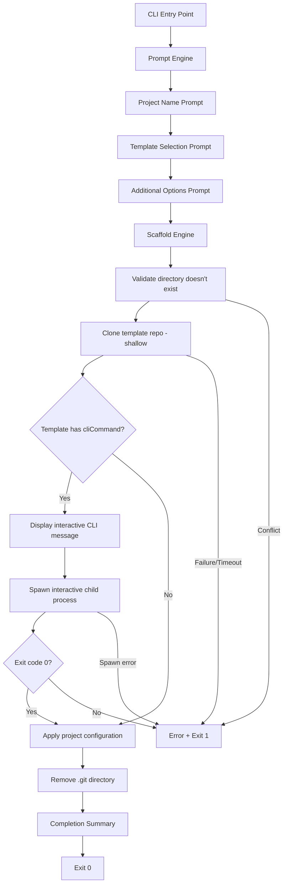

# Design Document

## Overview

The template-cli-enhancements feature extends retro-cli with two capabilities:

1. **Vite template registration** — Adds Vite as a selectable template in the registry with an associated interactive CLI command.
2. **Interactive CLI execution** — A new pipeline step that spawns a template-defined shell command (e.g., `npm create vite@latest`) as an interactive child process between the clone and configure steps, giving the user full terminal control to complete template-specific setup.

The design extends the existing `Template` interface with optional `cliCommand` and `cliDescription` fields, adds a new `src/scaffold/interactive.ts` module, and modifies the main pipeline in `index.ts` to insert the interactive step.

## Architecture



### Design Decisions

1. **`child_process.spawn` with `shell: true` and `stdio: 'inherit'`**: The interactive CLI command needs full terminal control (stdin/stdout/stderr). Using `spawn` with inherited stdio gives the child process direct access to the terminal, supporting interactive prompts, colors, and cursor manipulation. `shell: true` allows commands like `npm create vite@latest` to be executed as shell strings without manual parsing.

2. **Project name appended as final argument**: Templates like Vite and Expo expect the project name/directory as the last positional argument. Appending `projectName` to the `cliCommand` string keeps template definitions simple while maintaining compatibility with standard CLI conventions.

3. **CWD set to parent of target directory**: The interactive command runs with `cwd` set to the directory containing the target project folder. This matches how tools like `npm create vite@latest my-app` expect to create a subdirectory in the current working directory.

4. **No spinner during interactive execution**: Since stdio is inherited, any spinner output would interfere with the child process's terminal control. The module explicitly avoids ora during the interactive step.

5. **Optional fields on Template interface**: Using optional `cliCommand?: string` and `cliDescription?: string` maintains backward compatibility — existing templates without these fields continue to work unchanged, and the interactive step is simply skipped.

## Components and Interfaces

### Module Structure (changes highlighted)

```
src/
├── index.ts                # Modified: insert interactive step between clone and configure
├── scaffold/
│   ├── clone.ts            # Unchanged
│   ├── configure.ts        # Unchanged
│   └── interactive.ts      # NEW: interactive CLI execution module
├── templates/
│   └── registry.ts         # Modified: add Vite template, add cliCommand/cliDescription to Expo and Vite
├── types.ts                # Modified: extend Template interface
└── ...                     # Other modules unchanged
```

### Extended Template Interface

```typescript
// types.ts (additions)
export interface Template {
  name: string;
  displayName: string;
  description: string;
  repoUrl: string;
  cliCommand?: string;       // NEW: optional shell command to run interactively
  cliDescription?: string;   // NEW: optional plain-text description (max 200 chars)
}

export class InteractiveCliError extends ScaffoldError {
  constructor(public command: string, public exitCode: number | null) {
    super(`Interactive command "${command}" failed with exit code ${exitCode}`);
    this.name = 'InteractiveCliError';
  }
}

export class InteractiveCliSpawnError extends ScaffoldError {
  constructor(public command: string, cause?: Error) {
    super(`Failed to start interactive command "${command}"`, cause);
    this.name = 'InteractiveCliSpawnError';
  }
}
```

### Interactive CLI Module API

```typescript
// scaffold/interactive.ts

export interface InteractiveCliResult {
  executed: boolean;       // Whether the interactive step ran
  command?: string;        // The command that was executed (if any)
  exitCode?: number;       // The exit code (if executed)
}

/**
 * Runs the template's interactive CLI command if defined.
 * Spawns the command as a child process with inherited stdio.
 * Returns a result indicating whether the step was executed.
 *
 * @throws InteractiveCliError if the command exits with non-zero code
 * @throws InteractiveCliSpawnError if the command fails to spawn
 */
export function runInteractiveCli(config: ScaffoldConfig): Promise<InteractiveCliResult>;

/**
 * Builds the full command string by appending the project name.
 * Pure function, useful for testing.
 */
export function buildCommand(cliCommand: string, projectName: string): string;
```

### Updated Registry Data

```typescript
// templates/registry.ts (updated entries)
const templates: Template[] = [
  {
    name: 'expo',
    displayName: 'Expo (React Native)',
    description: 'Mobile app with Expo and React Native',
    repoUrl: 'https://github.com/retro-templates/expo-template.git',
    cliCommand: 'npx create-expo-app',
    cliDescription: 'Runs the Expo CLI to configure your mobile app with framework selection and TypeScript setup',
  },
  {
    name: 'vite',
    displayName: 'Vite',
    description: 'Frontend tooling with Vite',
    repoUrl: 'https://github.com/retro-templates/vite-template.git',
    cliCommand: 'npm create vite@latest',
    cliDescription: 'Runs the Vite scaffolding tool to select your framework and variant',
  },
  {
    name: 'storybook',
    displayName: 'Storybook',
    description: 'Component library with Storybook',
    repoUrl: 'https://github.com/retro-templates/storybook-template.git',
  },
  {
    name: 'angular',
    displayName: 'Angular',
    description: 'Angular application with TypeScript',
    repoUrl: 'https://github.com/retro-templates/angular-template.git',
  },
];
```

### Updated Pipeline (index.ts)

```typescript
// Between clone and configure:
import { runInteractiveCli } from './scaffold/interactive.js';

// ... inside action handler:
// 6. Clone template
await cloneTemplate(config);

// 7. Run interactive CLI (if template defines one)
await runInteractiveCli(config);

// 8. Configure project
await configureProject(config);

// 9. Print summary
printSummary(result);
```

## Data Models

### Template Registry Data (Updated)

| Field | Type | Required | Description |
|-------|------|----------|-------------|
| name | string | Yes | Internal identifier |
| displayName | string | Yes | Human-readable name |
| description | string | Yes | Short description |
| repoUrl | string | Yes | Git repository URL |
| cliCommand | string | No | Shell command to run interactively |
| cliDescription | string | No | Plain-text description of the command (max 200 chars) |

### InteractiveCliResult

| Field | Type | Description |
|-------|------|-------------|
| executed | boolean | Whether the interactive step ran |
| command | string? | The full command string that was executed |
| exitCode | number? | The child process exit code |

### Spawn Configuration

| Parameter | Value | Rationale |
|-----------|-------|-----------|
| command | `${cliCommand} ${projectName}` | Appends project name as final argument |
| options.shell | `true` | Allows command strings with spaces and pipes |
| options.stdio | `'inherit'` | Full terminal control for the child process |
| options.cwd | `path.dirname(config.targetDir)` | Parent directory so the CLI tool can create/modify the project folder |

## Correctness Properties

*A property is a characteristic or behavior that should hold true across all valid executions of a system — essentially, a formal statement about what the system should do. Properties serve as the bridge between human-readable specifications and machine-verifiable correctness guarantees.*

### Property 1: Interactive step conditional execution

*For any* template, the interactive CLI step SHALL execute (attempt to spawn a child process) if and only if the template defines a `cliCommand` field. Templates without `cliCommand` SHALL result in a skipped execution (no process spawned) regardless of whether `cliDescription` is present.

**Validates: Requirements 2.4, 2.6, 2.7**

### Property 2: Pre-execution message contains command and description

*For any* template with a defined `cliCommand` and `cliDescription`, the message displayed before spawning the interactive process SHALL contain both the `cliCommand` value and the `cliDescription` value. For templates with `cliCommand` but no `cliDescription`, the message SHALL contain the `cliCommand` value.

**Validates: Requirements 3.1**

### Property 3: Exit code determines success or failure

*For any* interactive CLI execution, if the child process exits with code 0 the function SHALL resolve successfully (not throw). If the child process exits with any non-zero exit code, the function SHALL throw an error whose message contains the `cliCommand` value.

**Validates: Requirements 3.3, 3.4**

### Property 4: Command construction appends project name

*For any* template `cliCommand` string and any valid project name, the constructed command string passed to spawn SHALL equal `${cliCommand} ${projectName}` — the original command with the project name appended as the final space-separated token.

**Validates: Requirements 3.8**

## Error Handling

### New Error Types

| Error Class | Trigger | User Message |
|-------------|---------|--------------|
| `InteractiveCliError` | Child process exits with non-zero code | `Interactive command "{command}" failed with exit code {code}` |
| `InteractiveCliSpawnError` | Child process fails to spawn (ENOENT, EACCES) | `Failed to start interactive command "{command}"` |

### Error Scenarios

| Scenario | Behavior | Recovery |
|----------|----------|----------|
| Template has no `cliCommand` | Skip interactive step, proceed to configure | N/A (not an error) |
| Command not found (ENOENT) | Throw `InteractiveCliSpawnError` | Exit with code 1 |
| Permission denied (EACCES) | Throw `InteractiveCliSpawnError` | Exit with code 1 |
| Command exits with non-zero code | Throw `InteractiveCliError` with exit code | Exit with code 1 |
| SIGINT during child process | Signal forwarded to child (automatic with inherited stdio), parent exits | Exit with code 1 |
| Missing package.json after interactive step | Caught by existing `configureProject` error handling | Exit with code 1 |

### Error Propagation

The `runInteractiveCli` function throws typed errors that bubble up to the CLI entry point in `index.ts`, which already handles errors with a generic catch block:

```typescript
} catch (error) {
  if (error instanceof Error && error.message.includes('User force closed')) {
    process.exit(1);
  }
  console.error(`\nError: ${error instanceof Error ? error.message : String(error)}`);
  process.exit(1);
}
```

No changes to the error handling in `index.ts` are needed — the new error types extend `ScaffoldError` and their messages are user-friendly.

### Signal Handling

When `stdio: 'inherit'` is used, SIGINT (Ctrl+C) is automatically delivered to the child process by the terminal. The parent process's existing SIGINT handler will fire after the child exits, triggering the standard cleanup path. No additional signal forwarding logic is needed.

## Testing Strategy

### Testing Framework

- **Unit/Example tests**: Vitest
- **Property-based tests**: fast-check (via Vitest)
- **Mocking**: Vitest built-in mocking for `child_process.spawn`

### New Test Files

```
tests/
├── unit/
│   ├── interactive.test.ts       # Unit tests for interactive CLI module
│   └── registry.test.ts          # Extended: verify Vite template and cliCommand fields
├── properties/
│   └── interactive.property.ts   # Property tests for interactive CLI behavior
└── integration/
    └── cli.test.ts               # Extended: verify pipeline order with interactive step
```

### Property-Based Testing Configuration

- Library: **fast-check**
- Minimum iterations: **100 per property**
- Each property test references its design document property via tag comment:
  ```typescript
  // Feature: template-cli-enhancements, Property 1: Interactive step conditional execution
  ```

### Unit Test Coverage

| Component | Focus |
|-----------|-------|
| `interactive.ts` | Spawn called with correct args, stdio inherit, shell true, cwd correct, error handling for ENOENT/EACCES, non-zero exit codes |
| `registry.ts` | Vite template present with correct fields, Expo has cliCommand, Storybook/Angular have no cliCommand |
| `types.ts` | New error classes instantiate correctly with expected messages |

### Property Test Coverage

| Property | Generator Strategy |
|----------|-------------------|
| Property 1 (conditional execution) | Generate random Template objects with and without `cliCommand`. Mock spawn. Verify spawn called iff cliCommand defined. |
| Property 2 (message content) | Generate random cliCommand strings and cliDescription strings. Capture console output. Verify message contains both values. |
| Property 3 (exit code) | Generate random exit codes (0 and non-zero integers 1–255). Mock spawn to emit 'close' with that code. Verify resolve vs reject. |
| Property 4 (command construction) | Generate random cliCommand strings and valid project names. Verify `buildCommand` output equals `${cliCommand} ${projectName}`. |

### Integration Test Coverage

| Scenario | Verification |
|----------|-------------|
| Full pipeline with cliCommand template | Clone → interactive → configure → summary order maintained |
| Full pipeline without cliCommand template | Clone → configure → summary (interactive skipped) |
| Interactive command failure | Pipeline stops, error displayed, no configure/summary |
| SIGINT during interactive | Process exits with non-zero code |
