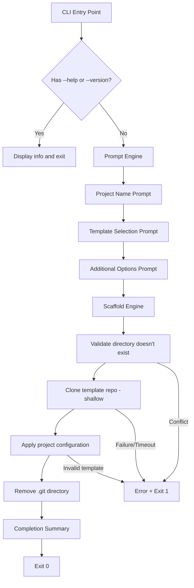

# Design Document

## Overview

The template-cli feature implements a CLI tool (`retro-cli`) that scaffolds new projects from remote git template repositories. The tool guides users through an interactive prompt workflow — collecting a project name, template selection, and optional configuration additions — then clones the chosen template, applies configuration, and outputs a ready-to-use project directory.

The implementation uses Commander.js for CLI argument parsing, Inquirer for interactive prompts, simple-git for git operations, and ora for spinner feedback. The architecture follows a pipeline pattern: CLI Entry → Prompts → Scaffold → Summary.

## Architecture



### Design Decisions

1. **Inquirer over prompts**: Inquirer (`@inquirer/prompts`) is the most widely adopted interactive prompt library for Node.js CLIs. It supports input validation, list selection, and checkbox multi-select out of the box.

2. **simple-git over child_process**: `simple-git` provides a promise-based API with built-in timeout support, error handling, and progress events — avoiding manual `spawn`/`exec` management and cross-platform shell concerns.

3. **ora for spinners**: Lightweight, widely used, handles terminal stream management cleanly. Pairs well with async operations.

4. **Pipeline architecture**: Each phase (prompts → scaffold → summary) is a discrete module. This keeps concerns separated and makes individual components testable in isolation.

5. **Shallow clone (depth 1)**: Minimizes download time and disk usage since template history is irrelevant to the scaffolded project.

## Components and Interfaces

### Module Structure

```
src/
├── index.ts              # CLI entry point, Commander setup
├── prompts/
│   ├── projectName.ts    # Project name prompt + validation
│   ├── templateSelect.ts # Template selection prompt
│   └── options.ts        # Additional options multi-select
├── templates/
│   └── registry.ts       # Template registry (list + metadata)
├── scaffold/
│   ├── clone.ts          # Git clone operations
│   └── configure.ts      # Post-clone configuration (package.json, options)
├── summary.ts            # Completion summary output
├── validators.ts         # Shared validation functions
└── types.ts              # Shared type definitions
```

### Interfaces

```typescript
// types.ts

export interface Template {
  name: string;           // Internal identifier (e.g., "expo")
  displayName: string;    // Human-readable name (e.g., "Expo (React Native)")
  description: string;    // Short description shown in selection list
  repoUrl: string;        // Remote git repository URL
}

export interface AdditionalOption {
  name: string;           // Internal identifier (e.g., "jest")
  displayName: string;    // Human-readable label (e.g., "Jest")
  description: string;    // Short description
}

export interface ScaffoldConfig {
  projectName: string;
  template: Template;
  additionalOptions: string[];  // Array of selected option names
  targetDir: string;            // Resolved absolute path for the project
}

export interface ScaffoldResult {
  projectName: string;
  projectPath: string;          // Absolute path to created directory
  template: Template;
  appliedOptions: string[];
}
```

### Component APIs

```typescript
// prompts/projectName.ts
export function promptProjectName(): Promise<string>;

// prompts/templateSelect.ts
export function promptTemplateSelection(templates: Template[]): Promise<Template>;

// prompts/options.ts
export function promptAdditionalOptions(options: AdditionalOption[]): Promise<string[]>;

// templates/registry.ts
export function getAvailableTemplates(): Template[];

// scaffold/clone.ts
export function cloneTemplate(config: ScaffoldConfig): Promise<void>;

// scaffold/configure.ts
export function configureProject(config: ScaffoldConfig): Promise<void>;

// validators.ts
export function validateProjectName(name: string): string | true;
export function isValidNpmPackageName(name: string): boolean;

// summary.ts
export function printSummary(result: ScaffoldResult): void;
```

### CLI Entry Point (index.ts)

```typescript
import { Command } from 'commander';

const program = new Command();

program
  .name('retro-cli')
  .description('Scaffold new projects from templates')
  .version(/* read from package.json */)
  .action(async () => {
    // 1. Prompt for project name
    // 2. Prompt for template selection
    // 3. Prompt for additional options
    // 4. Run scaffold pipeline
    // 5. Print summary
  });

program.parse();
```

## Data Models

### Template Registry Data

The template registry is a static configuration within the application. Templates are defined as an array:

```typescript
const templates: Template[] = [
  {
    name: 'expo',
    displayName: 'Expo (React Native)',
    description: 'Mobile app with Expo and React Native',
    repoUrl: 'https://github.com/retro-templates/expo-template.git',
  },
  {
    name: 'storybook',
    displayName: 'Storybook',
    description: 'Component library with Storybook',
    repoUrl: 'https://github.com/retro-templates/storybook-template.git',
  },
  {
    name: 'angular',
    displayName: 'Angular',
    description: 'Angular application with TypeScript',
    repoUrl: 'https://github.com/retro-templates/angular-template.git',
  },
];
```

### Additional Options Data

```typescript
const additionalOptions: AdditionalOption[] = [
  {
    name: 'jest',
    displayName: 'Jest',
    description: 'Jest testing configuration',
  },
  {
    name: 'eslint',
    displayName: 'ESLint',
    description: 'ESLint linting configuration',
  },
];
```

### Validation Rules

| Rule | Constraint |
|------|-----------|
| Project name length | 1–214 characters |
| Project name characters | Lowercase alphanumeric, hyphens, underscores only |
| Project name start | Must not start with `.` or `_` |
| npm package name | Lowercase, no spaces, max 214 chars, URL-safe characters |

### Error Exit Codes

| Scenario | Exit Code |
|----------|-----------|
| Successful scaffold | 0 |
| Template registry failure | 1 |
| Empty template list | 1 |
| Directory conflict | 1 |
| Clone failure (network, auth, invalid URL) | 1 |
| Clone timeout (30s) | 1 |
| Missing package.json in template | 1 |
| Invalid npm package name | 1 |
| User cancellation | 1 |

## Correctness Properties

*A property is a characteristic or behavior that should hold true across all valid executions of a system — essentially, a formal statement about what the system should do. Properties serve as the bridge between human-readable specifications and machine-verifiable correctness guarantees.*

### Property 1: Valid project names are accepted

*For any* string that is 1–214 characters long, contains only lowercase alphanumeric characters, hyphens, and underscores, and does not start with a dot or underscore, the `validateProjectName` function shall return `true` (accepted).

**Validates: Requirements 2.2**

### Property 2: Invalid character names are rejected

*For any* string that contains at least one character outside the set of lowercase alphanumeric characters, hyphens, and underscores, the `validateProjectName` function shall return an error string (rejected).

**Validates: Requirements 2.4**

### Property 3: Selected options are preserved through the pipeline

*For any* subset of available additional options selected by the user, the resulting `ScaffoldConfig.additionalOptions` array shall contain exactly the selected option names with no additions, removals, or reordering.

**Validates: Requirements 4.3**

### Property 4: Directory conflict detection

*For any* valid project name, if a directory with that name already exists in the current working directory, the scaffold engine shall reject the operation with a conflict error before attempting any clone.

**Validates: Requirements 5.3**

### Property 5: Package.json name update preserves structure

*For any* valid package.json object and any valid project name, updating the name field shall produce a valid JSON object where only the "name" field differs from the original and all other fields remain unchanged.

**Validates: Requirements 6.1**

### Property 6: Summary output contains all required information

*For any* scaffold result with a project name and absolute path, the printed summary shall contain the project name, the absolute path, a `cd` command to the project directory, and a command to install dependencies.

**Validates: Requirements 7.1, 7.2**

## Error Handling

### Error Categories

| Category | Trigger | User Message | Recovery |
|----------|---------|--------------|----------|
| Validation Error | Invalid project name | Specific message about which characters are invalid or length exceeded | Re-prompt the user |
| Registry Error | Template list retrieval failure | "Failed to retrieve available templates" | Exit with code 1 |
| Empty Registry | No templates available | "No templates are currently available" | Exit with code 1 |
| Directory Conflict | Target directory already exists | "Directory '{name}' already exists in the current directory" | Exit with code 1 |
| Clone Failure | Network, auth, or URL error | "Failed to clone template: {reason}" | Exit with code 1 |
| Clone Timeout | Operation exceeds 30s | "Clone operation timed out after 30 seconds" | Clean up partial dir, exit with code 1 |
| Missing package.json | Template lacks package.json | "Template is missing a valid package.json file" | Exit with code 1 (no modifications made) |
| User Cancellation | Ctrl+C or prompt cancel | None (silent exit) | Exit with code 1 |

### Error Handling Strategy

1. **Validation errors** are recoverable — the prompt re-displays with the error message.
2. **Infrastructure errors** (clone failures, timeouts) are non-recoverable — display the error and exit.
3. **Cleanup on failure**: If a clone times out or fails mid-operation, any partially created directory is removed via `fs.rm(targetDir, { recursive: true, force: true })`.
4. **Graceful cancellation**: Register a SIGINT handler to clean up spinners and restore terminal state.
5. **Error propagation**: Each module throws typed errors that bubble up to the CLI entry point, which formats and displays them before exiting.

### Error Types

```typescript
export class ValidationError extends Error {
  constructor(public field: string, message: string) {
    super(message);
    this.name = 'ValidationError';
  }
}

export class ScaffoldError extends Error {
  constructor(message: string, public cause?: Error) {
    super(message);
    this.name = 'ScaffoldError';
  }
}

export class TimeoutError extends ScaffoldError {
  constructor(public timeoutMs: number) {
    super(`Clone operation timed out after ${timeoutMs / 1000} seconds`);
    this.name = 'TimeoutError';
  }
}

export class DirectoryConflictError extends ScaffoldError {
  constructor(public dirName: string) {
    super(`Directory '${dirName}' already exists in the current directory`);
    this.name = 'DirectoryConflictError';
  }
}
```

## Testing Strategy

### Testing Framework

- **Unit/Example tests**: Vitest (fast, TypeScript-native, compatible with yarn PnP)
- **Property-based tests**: fast-check (via Vitest integration)
- **Mocking**: Vitest built-in mocking for fs, child_process, and simple-git

### Test Structure

```
tests/
├── unit/
│   ├── validators.test.ts        # Project name validation
│   ├── registry.test.ts          # Template registry
│   ├── configure.test.ts         # Package.json configuration
│   └── summary.test.ts           # Summary output
├── properties/
│   ├── validators.property.ts    # Property tests for validation
│   ├── configure.property.ts     # Property tests for configuration
│   └── summary.property.ts       # Property tests for summary
└── integration/
    ├── cli.test.ts               # CLI entry point (--help, --version, unknown flags)
    ├── scaffold.test.ts          # End-to-end scaffold with mocked git
    └── prompts.test.ts           # Prompt flow integration
```

### Property-Based Testing Configuration

- Library: **fast-check**
- Minimum iterations: **100 per property**
- Each property test references its design document property via tag comment:
  ```typescript
  // Feature: template-cli, Property 1: Valid project names are accepted
  ```

### Unit Test Coverage

| Component | Focus |
|-----------|-------|
| `validators.ts` | Edge cases: empty string, 214 chars exactly, 215 chars, starts with dot/underscore, unicode |
| `registry.ts` | Returns correct template data, handles empty state |
| `configure.ts` | Jest config creation, ESLint config creation, .git removal, missing package.json |
| `summary.ts` | Output format, includes all required fields |
| `clone.ts` | Shallow clone args, timeout handling, cleanup on failure |

### Integration Test Coverage

| Scenario | Verification |
|----------|-------------|
| `--help` flag | Output contains tool name, description, options |
| `--version` flag | Output matches package.json version |
| Unknown flag | Error message + help suggestion |
| Full scaffold flow | Directory created, package.json updated, .git removed |
| Directory conflict | Error before clone attempt |
| Clone timeout | Partial directory cleaned up |

### Dependencies for Testing

```json
{
  "devDependencies": {
    "vitest": "^3.0.0",
    "fast-check": "^4.0.0",
    "@types/node": "^22.0.0",
    "typescript": "^5.7.0"
  }
}
```

